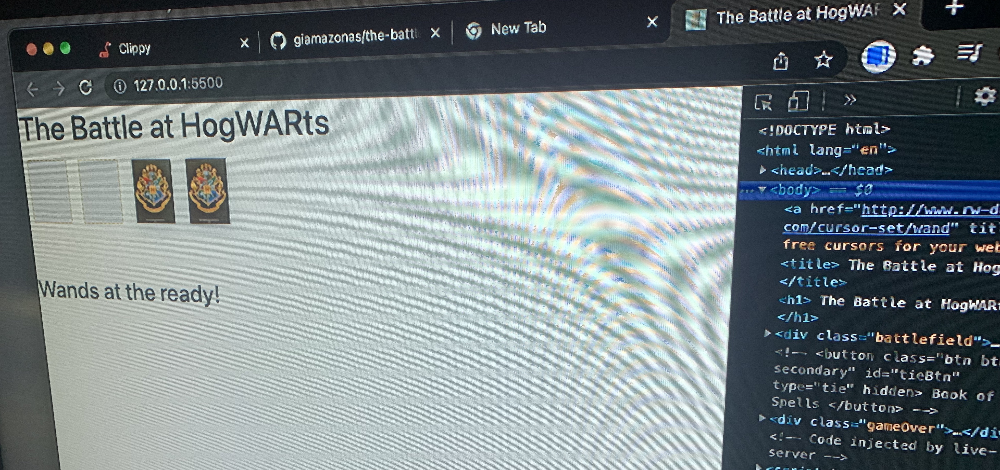
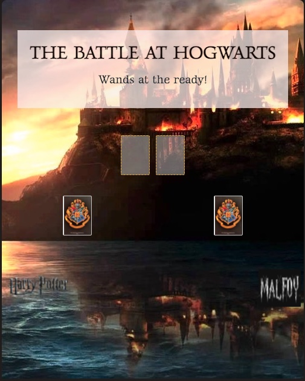
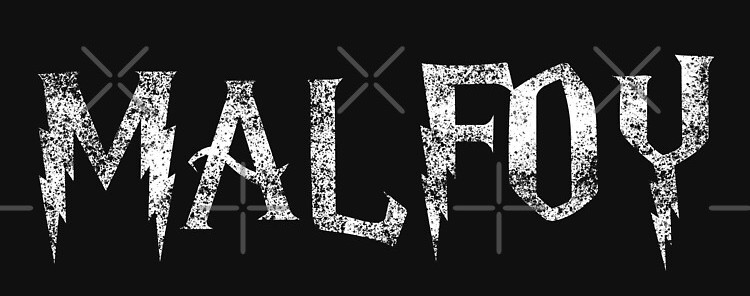
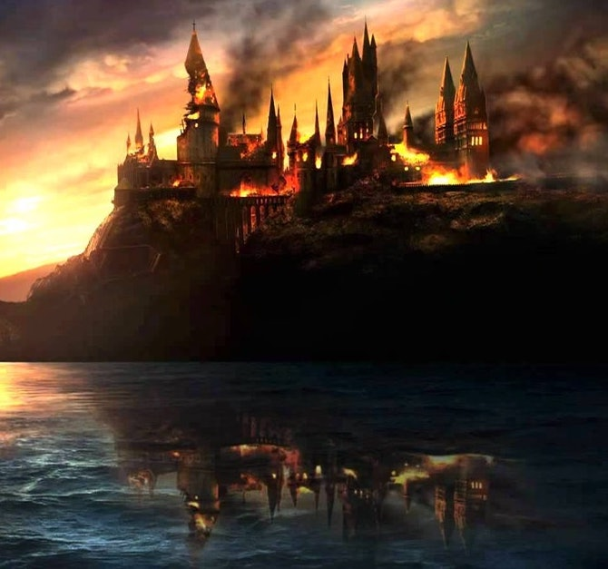
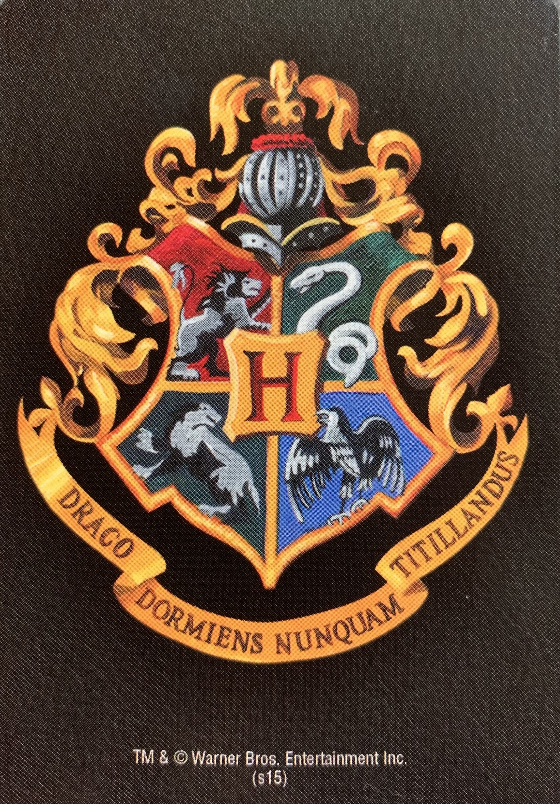
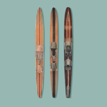

# The Battle at HogWARts

> "We must try not to sink beneath our anguish, but battle on." ~Albus Dumbledore

War is a card game typically played between two people.
 
The deck is split into two, and each turn consists of playing one card to the pot, and comparing their values.
 
Winner is the player with the highest value card, and they add both cards to their personal deck.
 
 
In the case of a tie, three cards from each player are added to the pot, and the last played card by each player, is compared again to find the winner of the entire pot.  
Game continues until one player has all the cards in their personal deck, making them the winner.
 
 
I grew up playing war as we sat and waited on our parents in various scenarios, so I have a lot of fond memories around it. Having a mobile game, without having to always have your deck of cards with you, would have been amazing! There are also a lot of Harry Potter fans in my circles, and so this seemed like the perfect combination of worlds. 
 
 

## PLAY HERE  
___________________
Here, you can play [The Battle at HogWARts](forgetful-current.surge.sh/)
 
 
Click on Harry's or Draco's deck of cards to play! 
 
 

### SCREENSHOTS
___________
Early on..

 
 
A little later..

 
 
Currently.. 

 
 

### TECH USED
________________

1. 
2. 
3. 
4. 
5. 
6. 
7. Visual Studio Code
 
 

### ICEBOX
___________________

- add music option
- show tie play cards
- update face of cards
- show how many cards players hold in their deck
- animated feature for when loser dies
- animated feature for when winner is declared
- animation to the smoke coming from Hogwarts
- at init, choose your wizard
 
 

### CREDITS
______________________________
[Card deck CSS](https://github.com/SEI-Remote/css-card-deck) from [General Assembly](https://generalassemb.ly/?&topic=&mkt_account_id=1056949875&mkt_campaign_id=691778069&mkt_ad_group_id=31181421810&mkt_device_type=c&mkt_keyword=general%20assembly&mkt_matchtype=e&mkt_placement=&mkt_ad_id=155524967456&mkt_network=g&mkt_target_id=kwd-459322816&mkt_feed_item_id=&utm_source=google&utm_medium=paid-search-bra&utm_campaign=TS:TX:BRA:ATL:BR:GeneralAssembly&utm_content=campus-lead-lander&utm_term=general%20assembly&gclid=CjwKCAiAgbiQBhAHEiwAuQ6BkqbMH5fVCFXKK55K1Yhy-DlFh9WwyoSdgq-RN8ttAsA7U-N4LscdGhoCREYQAvD_BwE)
 
 
[Harry Potter Wand](http://www.rw-designer.com/cursor-detail/128535)  
 
 
[Harry Potter logo](https://www.freeiconspng.com/img/32524)

 
 
[Malfoy logo](https://www.google.com/imgres?imgurl=https%3A%2F%2Fih1.redbubble.net%2Fimage.1765202837.3317%2Fgbrf%2C8x10%2Cf%2C540x540-pad%2C450x450%2Cf8f8f8.jpg&imgrefurl=https%3A%2F%2Fwww.redbubble.com%2Fi%2Fart-board-print%2FDraco-Malfoy-Quote-Terribly-Funny-Really-Witty-by-ind3finite%2F57763343.7Q6GI&tbnid=VBB_apZB0aRtnM&vet=12ahUKEwjU9PS-hof2AhUHIt8KHVINCoYQMygAegUIARCNAQ..i&docid=WGeygLV6aiA0vM&w=450&h=450&itg=1&q=dot&hl=en&ved=2ahUKEwjU9PS-hof2AhUHIt8KHVINCoYQMygAegUIARCNAQ)

 
 
[Hogwarts on fire image](https://www.reddit.com/r/harrypotter/comments/7oclda/it_all_ends_here/)

 
 
[Hogwarts Card deck](https://www.amazon.com/dp/B0125KO0YE?psc=1&ref=ppx_yo2_dt_b_product_details)

 
 
[Favicon](https://realfavicongenerator.net/#.Ygh3SPXMJJU) 
